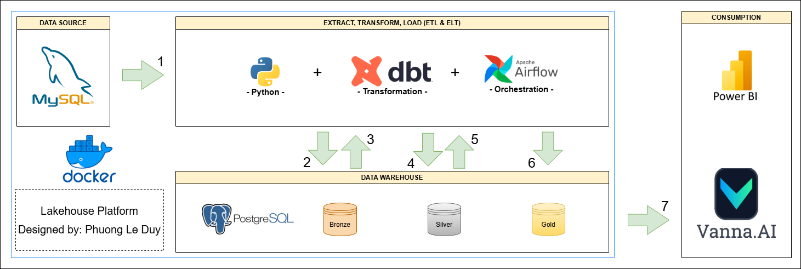

# Professional Essay Project - Data Pipeline for Analytical Processing

## Overview

This project was developed as part of a university course on specialized topics in data engineering. It demonstrates the design and implementation of an end-to-end data pipeline that ingests transactional data from an OLTP system, transforms it into analytical layers, and enables natural language querying through an AI-powered interface.

The primary objective of the system is to provide a scalable, maintainable, and incremental data processing workflow that supports downstream analytics and business intelligence use cases.

## Architecture Summary

The pipeline follows a modern **medallion architecture** with Bronze, Silver, and Gold layers:

- **Bronze Layer (Raw Data Warehouse)**
  Data is extracted from a MySQL OLTP source and loaded into a PostgreSQL data warehouse using **Apache Airflow**. Loading is performed incrementally using a **time-based watermark strategy** to ensure efficiency and avoid duplicate ingestion.

- **Silver Layer (Cleansed & Structured Data)**
  Raw data from the Bronze layer is cleaned, standardized, and validated using **dbt (Data Build Tool)** to ensure consistency and analytical reliability.

- **Gold Layer (Analytics-Ready Data)**
  Curated, business-level datasets are generated using dbt models. These datasets are optimized for reporting, dashboarding, and advanced analytical queries.

## Natural Language Query Interface

Processed analytical data is integrated with **Vanna AI**, enabling users to query the data warehouse using **natural language** through a web-based interface. This allows non-technical users to access insights without writing SQL.

## Technology Stack

The project leverages the following technologies:

- **Apache Airflow** – Workflow orchestration and scheduling
- **dbt** – Data transformation, modeling, and testing
- **MySQL** – Source OLTP database
- **PostgreSQL** – Analytical data warehouse
- **Docker** – Containerized development and deployment environment
- **Vanna AI** – Natural language interface for querying analytical data

## Key Features

- End-to-end **ETL/ELT data pipeline** implementation
- **Incremental loading** using time-based watermarking
- **Medallion architecture** (Bronze → Silver → Gold)
- Reproducible environment via **Docker**
- **Natural language analytics** powered by Vanna AI

## Implementing Project

All instructions are contained in the README.md files located in the `tlcn_tools` and `vanna_ai` folders.

## Learning Outcomes

Through this project, the following data engineering competencies were demonstrated:

- Designing scalable **data warehouse architectures**
- Building **orchestrated ETL/ELT pipelines**
- Implementing **incremental data processing strategies**
- Applying **data transformation best practices** with dbt
- Enabling **AI-assisted analytics** for end users

## License

This project is created for academic and educational purposes.
